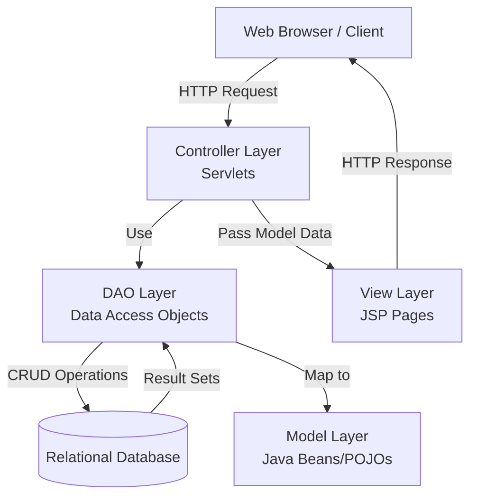
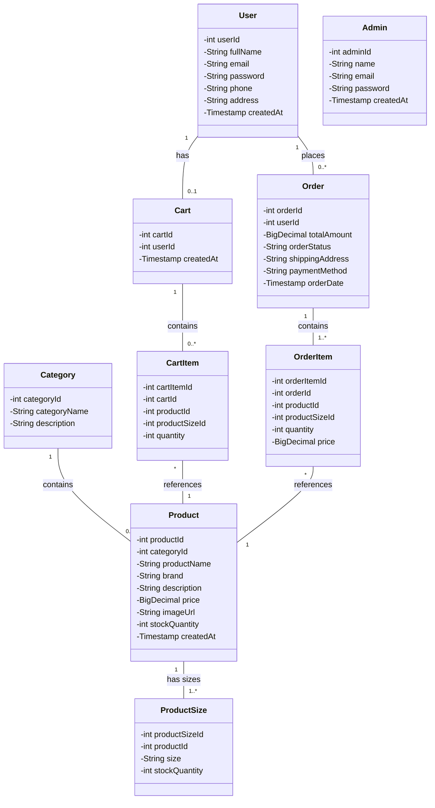
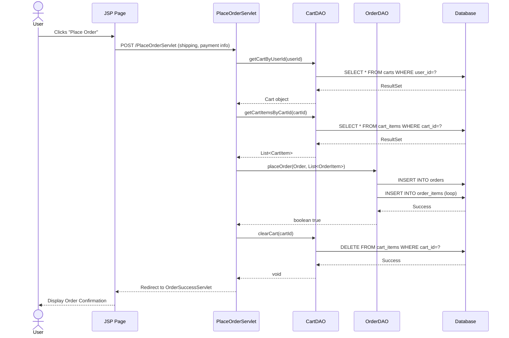

# Architecture Diagrams

## MVC Architecture Overview

The Fashion Store application follows a standard Model-View-Controller (MVC) architecture pattern:

### Components:
- **Model**: Represents the application data and business rules (`com.fashionstore.model`).
- **View**: Presents the data to the user, typically implemented using JSP and HTML in `src/main/webapp`.
- **Controller**: Servlets in `com.fashionstore.controller` that handle user requests, process them using DAOs, and forward the request to the appropriate View.
- **DAO Layer**: Interfaces and implementation classes in `com.fashionstore.dao` abstracting the database logic using JDBC.

## Class Diagram

The following diagram illustrates the primary model classes and their relationships:

## Sequence Diagram: Place Order Flow

The sequence diagram below shows the flow when a user places an order:

