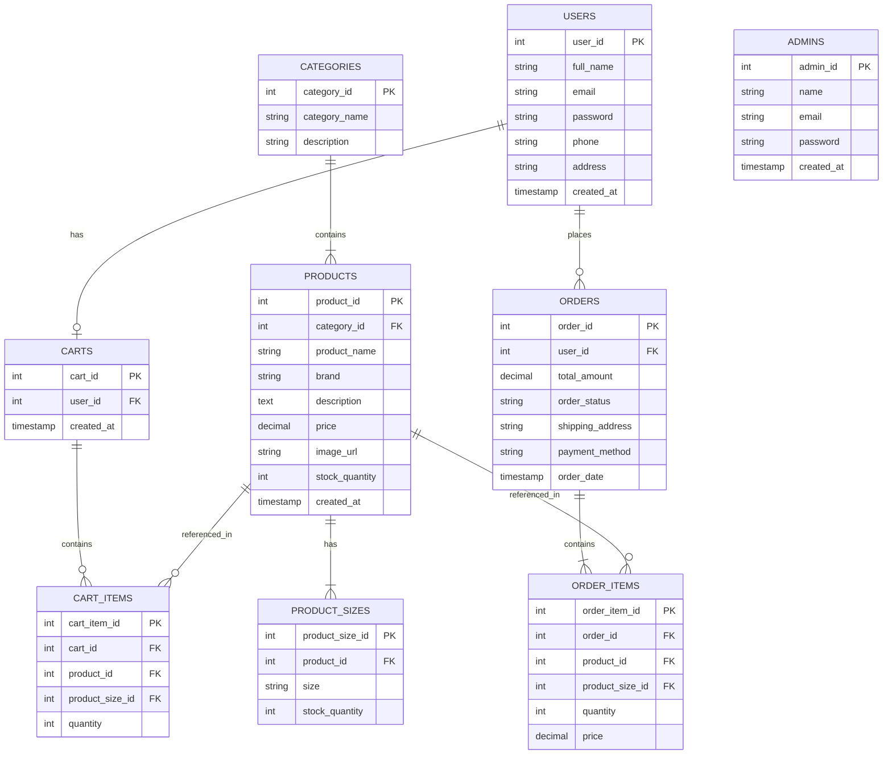

# Database Schema Documentation

This document describes the database tables, their relationships, and how they map to the respective Java model classes in the Fashion Store application.

## Entity-Relationship Overview

## Table to Java Class Mapping

| Database Table | Java Model Class | Description |
| :--- | :--- | :--- |
| `users` | `com.fashionstore.model.User` | Stores registered customer information including authentication and contact details. |
| `admins` | `com.fashionstore.model.Admin` | Stores administrator accounts for dashboard access. |
| `categories` | `com.fashionstore.model.Category` | Classifies products into different logical groupings (e.g., Men, Women, Accessories). |
| `products` | `com.fashionstore.model.Product` | Contains product details such as name, brand, overall stock, and price. Mapped to a category. |
| `product_sizes`| `com.fashionstore.model.ProductSize` | Tracks inventory for specific sizes of a product. Maps back to the `products` table. |
| `carts` | `com.fashionstore.model.Cart` | Represents a user's active shopping session. Each user typically has one active cart. |
| `cart_items` | `com.fashionstore.model.CartItem` | Items currently added to a cart. Links the cart to the specific product, size, and quantity. |
| `orders` | `com.fashionstore.model.Order` | Finalized purchases placed by a user, including total cost and shipping information. |
| `order_items` | `com.fashionstore.model.OrderItem` | Snapshot of the products purchased in a specific order, including the price at the time of purchase. |

## Relationships

- **One-to-Many**: `Category` -> `Product`. One category can have multiple products.
- **One-to-Many**: `Product` -> `ProductSize`. A single product can be available in multiple sizes.
- **One-to-One**: `User` -> `Cart`. A user is assigned a single cart for their session.
- **One-to-Many**: `Cart` -> `CartItem`. A cart contains multiple items.
- **One-to-Many**: `User` -> `Order`. A user can place multiple orders over time.
- **One-to-Many**: `Order` -> `OrderItem`. An order consists of one or more items.
